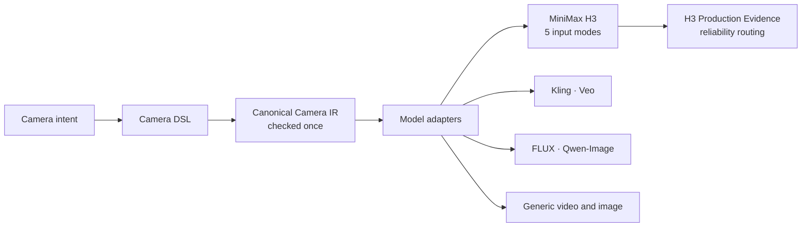

**English** | [繁體中文](README.zh-TW.md)

# Cinematic Director Camera DSL

**AI Video Camera Control DSL for MiniMax H3, Kling, Veo, FLUX and Qwen Image**

**Control AI video cameras with a real camera language, not vague prompt words.**

Write the shot once. Keep the camera intent. Compile it for each model.

```text
/MS /LOWANGLE /DOLLYIN:MS>MCU:SLOW
```

The same camera intent, compiled for **MiniMax H3 · Kling · Veo · FLUX · Qwen-Image · Qwen-Image-Edit · generic video and image models**.

**MiniMax H3 adds production-tested reliability routing** across all five H3 input modes: T2VA, I2VA, FL2VA, L2VA and Ref2VA.

`104 commands` · `244 aliases` · `8 model adapters` · `5 H3 input modes` · `866/866 tests passing` · `MIT`

A skill for Claude Code, with a Python command line. It brings real cinematography into AI video prompt engineering, and the camera text fits into any prompt, including a ComfyUI workflow. [30-second demo](#30-second-demo) · [Install](#install) · [Quick start](#quick-start) · [Tested on MiniMax H3](#tested-on-minimax-h3)

## 30-second demo

You want: *medium shot, low angle, slowly move the camera toward the subject, end on a medium close-up.*

You write:

```text
/MS /LOWANGLE /DOLLYIN:MS>MCU:SLOW
```

The skill reads it as one exact camera intent:

| | |
|---|---|
| Shot size | medium shot, waist up |
| Viewpoint | low angle, looking up |
| Movement | dolly in: the camera travels toward the subject; it is not a zoom |
| Start framing | MS |
| End framing | MCU, chest up |
| Speed | SLOW |
| Left open | how far the camera travels, listed instead of invented |

MiniMax H3 camera text, real output:

> The camera looks up at {SUBJECT} from a low angle. The camera starts on a medium shot that frames {SUBJECT} from the waist up. The camera pushes in at slow speed. The push continues steadily over the whole video. The final frame is a medium close-up of {SUBJECT} from the chest up. The focal length stays the same.

And what to watch for, with H3's first-frame mode selected (real output, long lines shortened with …):

```text
WARNING: S1: H3: with nothing near the lens a push reads as a zoom (SRC-009 camera-grammar:41-43). The DSL cannot add scene objects; add a near object in the scene description if the travel must read.
UNSPECIFIED (left to the model): S1.DOLLYIN.amount
H3 routing (models/minimax_h3_profile.yaml) — evidence scope: mode I2VA, generation profile LOCAL_H3_I2VA_PDD8_Q_416: MIXED
  shot size MEDIUM SHOT: from the first frame — reliability HIGH (PROVISIONAL)
  DOLLYIN production route (DSL semantics unchanged): … with_foreground_motion_anchor: PARALLAX_ASSISTED_PUSH_IN PRODUCTION_VALIDATED (… confidence 3/3 tested seeds PASS …)
  UNVERIFIED under this scope: LOWANGLE
```

In plain words: in H3's first-frame mode, a push-in from a medium shot to a medium close-up passed 3 of 3 tests when the first frame had an object close to the lens. The low angle was never measured in that mode, so it is marked UNVERIFIED instead of being guessed.

## Why not just write camera prompts?

**Without the DSL**

> "slow cinematic push in from a low angle"

- Is that a dolly or a zoom?
- How low is the camera?
- Where does the shot start, and where should it end?
- Will the prompt for the next model quietly change the move?
- Does H3 actually follow it?

**With the DSL**

```text
/MS /LOWANGLE /DOLLYIN:MS>MCU:SLOW
```

- ✓ Dolly, not zoom
- ✓ Starts on a medium shot
- ✓ Ends on a medium close-up
- ✓ Low-angle viewpoint kept
- ✓ Speed stated
- ✓ The wording can change per model; the camera cannot
- ✓ H3 evidence can be checked before you render

## Why this is different

**One camera language, with moves kept apart.** Prompt words often blur these. The DSL never does:

| Not the same | The difference |
|---|---|
| Pan ≠ Truck | a pan turns the camera in place; a truck slides it sideways |
| Tilt ≠ Pedestal | a tilt turns the camera up or down; a pedestal raises or lowers the whole camera |
| Dolly ≠ Zoom | a dolly moves the camera; a zoom only changes the focal length |
| Orbit ≠ subject turning | the camera circles the subject; the subject stays as it is |
| POV ≠ looking into the lens | POV shows what a character sees; looking into the lens is an eyeline |
| Rack focus ≠ camera move | the focus shifts; the camera does not move |
| Wide shot ≠ wide-angle lens | one is a shot size, the other is a lens |

**Adapters change the wording, never the intent.** One shot, three models, real output:

| Model | Camera text for `/MS /LOWANGLE /DOLLYIN:MS>MCU:SLOW` |
|---|---|
| MiniMax H3 | The camera looks up at {SUBJECT} from a low angle. The camera starts on a medium shot … The camera pushes in at slow speed. … |
| Kling | 中景，{SUBJECT}腰部以上入画。仰拍，镜头从下往上看{SUBJECT}。推镜：镜头缓慢地向前推进靠近{SUBJECT}，最后停在近景… |
| Veo | A medium shot framing {SUBJECT} from the waist up. The camera looks up at {SUBJECT} from a low angle. From this opening framing, the camera moves forward along the lens axis toward {SUBJECT}, slowly. … |

**Strict by default.** The skill does not invent a speed, an amount, an end framing, a lens, a focus setting or an extra move. What you leave open is listed under `UNSPECIFIED`. Values that a command's own definition fixes, such as a crash zoom being fast and large, are shown as `DEFINITION_IMPLIED`.

**Director mode only when you ask.** Suggestions are labelled `DIRECTOR_SUGGESTED`, kept apart from what you wrote, and never replace it.

**Evidence for H3, kept to its scope.** It does not pretend all H3 modes behave the same.

## Tested on MiniMax H3

A prompt list stops at the prompt. This project also rendered the shots on MiniMax H3 and measured what the camera actually did, in every input mode:

| Mode | What you give H3 |
|---|---|
| T2VA | text only |
| I2VA | a first frame |
| FL2VA | a first frame and a last frame |
| L2VA | a last frame |
| Ref2VA | reference pictures, such as a face or an outfit |

All five generate video with sound. All five use the same camera core: each mode's wrapper only places the camera text into that mode's official prompt structure. No mode has a camera language of its own.

What the tests show:

- **The same move can be reliable in one mode and weak in another.** `/MS /TILT:DOWN` is PRODUCTION_VALIDATED in I2VA, FL2VA and L2VA, and LOW in T2VA and Ref2VA.
- **Text alone moves the camera, but does not hold a shot size.** In T2VA, 9 of 12 camera-only routes are PRODUCTION_VALIDATED; with a required start shot size, 0 of 16 are, mostly because text-only shots start wider than asked.
- **The dolly works in several modes.** A camera-only `/DOLLYIN` is PRODUCTION_VALIDATED in T2VA, I2VA and Ref2VA.
- **The 45-degree orbit is weak.** `/ORBIT:R:45` is LOW in T2VA, I2VA, L2VA and Ref2VA, in both evidence types.
- **FL2VA follows its keyframes.** With a last frame that already shows the end of the move, 11 of 16 constrained routes are PRODUCTION_VALIDATED. With the same picture as first and last frame, the camera does not move.

## Production evidence explained

There is one camera language and one set of evidence, the **H3 Camera Production Evidence**, of two types.

**CAMERA_ONLY: does H3 perform the move?**
Pan, tilt, truck, pedestal, dolly, orbit and a locked shot, tested on a fixed set with nothing to frame. The verdict comes from the camera geometry in the video: whether near, middle and far parts of the scene move together, as in a rotation, or in depth order, as in a translation; how the perspective changes; where the vanishing point goes.

**CONSTRAINED_PRODUCTION: does H3 perform the move and still meet the shot's requirements?**
Start framing, end framing, landing, screen position and behaviour relative to a reference target. The reference target in these tests was a person; it could be a group, a vehicle, an object or a building. It is a test setup, not a category of the DSL.

| Status | Meaning |
|---|---|
| PRODUCTION_VALIDATED | 3 of 3 tested seeds passed |
| CONDITIONAL | 2 of 3 passed |
| LOW | 0 or 1 of 3 passed |
| INSUFFICIENT_EVIDENCE | the input could not express the move, or the measurement could not decide |
| UNVERIFIED | this exact scope was not measured |

**Reliability is scoped.** A result holds only for its own mode, test profile, command, direction, start and end framing, angle and evidence type. Real routing answers:

- I2VA is not lent to T2VA: `/MS /TILT:DOWN` is PRODUCTION_VALIDATED in I2VA and stays LOW in T2VA.
- MS is not lent to FS: `/FS /TILT:DOWN` gets "no production route measured under this scope for start framing FS — UNVERIFIED", and `/MS /TILT:DOWN` is only named as related evidence.
- 45 degrees is not lent to 90: `/MS /ORBIT:R:90` gets UNVERIFIED, with `/MS /ORBIT:R:45` named as related evidence.

No exact evidence means UNVERIFIED, never a guessed grade.

Results per mode, as PRODUCTION_VALIDATED / CONDITIONAL / LOW / INSUFFICIENT_EVIDENCE, 3 seeds per route:

| Mode | CONSTRAINED_PRODUCTION, 16 routes | CAMERA_ONLY, 12 routes |
|---|---|---|
| T2VA | 0 / 0 / 16 / 0 | 9 / 1 / 2 / 0 |
| I2VA | 3 / 2 / 11 / 0 | 2 / 6 / 4 / 0 |
| FL2VA | 11 / 0 / 1 / 4 | 1 / 0 / 0 / 11 |
| L2VA | 2 / 3 / 11 / 0 | 1 / 2 / 6 / 3 |
| Ref2VA | 0 / 1 / 15 / 0 | 7 / 2 / 2 / 1 |

Every route with its limitation: [models/minimax_h3.md](models/minimax_h3.md).

## What can I use it for?

- Turn storyboard camera directions into exact camera commands.
- Look up everyday camera phrases such as 慢推近, 仰拍英雄 or 遮擋轉場; a phrase that leaves the camera open comes back with a question, not a guess.
- Keep the same camera intent when you switch AI video models.
- Build complete H3 prompts for T2VA, I2VA, FL2VA, L2VA and Ref2VA.
- Catch camera contradictions before you render.
- Check axis, eyeline and screen direction across the shots of a scene.
- Keep dolly and zoom, pan and truck, tilt and pedestal apart.
- Ask for director suggestions without losing the shot you wrote.
- Check the H3 evidence for a move before you spend GPU time on it.

## Supported models

| Model | Adapter | Measured evidence |
|---|---|---|
| MiniMax H3 | yes, all five input modes | yes: H3 Camera Production Evidence |
| Kling | yes | no: wording based on documented guides |
| Veo | yes | no: wording based on documented guides |
| FLUX | yes, still images | no |
| Qwen-Image | yes, still images | no |
| Qwen-Image-Edit | yes, still images | no |
| Generic video | yes | no: the most explicit wording |
| Generic image | yes | no: a move becomes the camera position it implies |

Only MiniMax H3 has measured reliability. For the other models, check the first render.

## Install

```bash
git clone https://github.com/SK-SL-source/cinematic-director-camera-dsl "$HOME/.claude/skills/cinematic-director-camera-dsl"
```

Restart Claude Code. Done. Python 3 is all it needs: no packages, no API key.

## Quick start

**In Claude Code**, start with the skill name, then the shot:

```text
/cinematic-director-camera-dsl /MS /LOWANGLE /DOLLYIN:MS>MCU:SLOW
```

Put the skill name first: a message that starts with `/MS` would be read as a slash command. You can also describe the shot in words and ask Claude to use the skill; it shows which commands it chose.

**On the command line**, from the skill folder:

```bash
python scripts/camera_dsl.py render "/MS /LOWANGLE /DOLLYIN:MS>MCU:SLOW" --model minimax_h3
python scripts/camera_dsl.py render "/WS /PAN:L" --model kling
python scripts/camera_dsl.py explain /DOLLYIN
python scripts/example_library.py search "慢推近"
```

Models: `minimax_h3`, `kling`, `veo`, `flux`, `qwen_image`, `qwen_image_edit`, `generic_video`, `generic_image`. In Git Bash on Windows, put `MSYS_NO_PATHCONV=1` in front of the command.

You get back the camera text, plus:

| Line | Meaning |
|---|---|
| `UNSPECIFIED` | what you left to the model |
| `DEFINITION_IMPLIED` | values fixed by the command itself |
| `WARNING` | it renders, with a risk you should know |
| `ERROR` | nothing is rendered; the reason and the fix are shown |
| `H3 routing` | for MiniMax H3: the measured reliability in your scope |

## H3 usage

```bash
# camera text plus the measured reliability in one mode
python scripts/camera_dsl.py render "/MS /TILT:DOWN" --model minimax_h3 --h3-mode i2va --h3-profile LOCAL_H3_I2VA_PDD8_Q_416

# a move with nothing to frame: read the CAMERA_ONLY evidence
python scripts/camera_dsl.py render "/DOLLYIN" --model minimax_h3 --h3-profile LOCAL_H3_T2VA_PDD8_Q_416 --h3-subject-context camera_only

# the complete official H3 prompt for a mode, around the same camera text
python scripts/h3_wrappers.py i2va "/MS /TILT:DOWN"
```

| Mode | Test profile |
|---|---|
| T2VA | `LOCAL_H3_T2VA_PDD8_Q_416` |
| I2VA | `LOCAL_H3_I2VA_PDD8_Q_416` |
| FL2VA | `LOCAL_H3_FL2VA_PDD8_Q_416` |
| L2VA | `LOCAL_H3_L2VA_PDD8_Q_416` |
| Ref2VA | `LOCAL_H3_REF2VA_PDD8_Q_416` |

Without a profile every item is UNVERIFIED: there is no default and nothing is guessed. `--lang zh` prints the routing in Chinese.

Practical tips from the tests:

- Need an exact opening frame? Give H3 a first frame. Text-only shots tend to start wider than asked.
- Want a push-in to read as camera travel, not a zoom? Put an object close to the lens in the first frame.
- One camera move per shot is the safest.

## Command cheatsheet

| Group | Commands |
|---|---|
| Shot size | `/EWS /WS /FS /MFS /COWBOY /MS /MCU /CU /ECU` |
| Angle and height | `/EYELEVEL /HIGHANGLE /LOWANGLE /BIRDSEYE /TOPDOWN /WORMSEYE /DUTCH /GROUNDLEVEL /SHOULDERLEVEL` |
| Camera movement | `/PAN:L /TILT:UP /TRUCK:R /PEDESTAL:DOWN /DOLLYIN /DOLLYOUT /ZOOMIN /ZOOMOUT /CRANE:UP /DOLLYZOOM` |
| Around or with a subject | `/ORBIT:R:45 /TRACKSIDE:R /FOLLOW /LEAD` |
| Lens and focus | `/WIDEANGLE /TELEPHOTO /MACRO /SHALLOW /DEEPFOCUS /RACKFOCUS:A>B` |
| Framing and composition | `/OTS:A>B /TWOSHOT /POV /PROFILE /THIRDS /CENTER /SYMMETRY /NEGSPACE` |

Details go after a colon: start and end framing `/DOLLYIN:MS>MCU`, speed `:SLOW`, direction `:L` `:R` `:UP` `:DOWN`, angle `/ORBIT:R:45`. `explain` gives the exact meaning of any command. All 104 commands are in [references/](references/), alternative names in [references/15_aliases.md](references/15_aliases.md).

## Storyboard, multi-shot and continuity

```bash
python scripts/camera_dsl.py shots "S1: /WS /AXIS:A-B\nS2: /MCU /OTS:A>B"
```

- One shot per line, `S1:`, `S2:` and so on; a typed `\n` separates them on the command line.
- `CONTINUOUS` makes a shot start where the last one ended.
- Moves in order inside one shot: `0-3s: /PAN:R 3-7s: /DOLLYIN:SLOW` or `/PAN:R THEN /DOLLYIN`.
- Continuity is checked across shots. Crossing the line without saying so is stopped, real output:

```text
ERROR: S2: [C01-AXIS-CROSSED] S2: the line flips (A-B -> B-A) without a declared crossing. Fix: Add /CROSSAXIS:MOVE|NEUTRAL|CUTAWAY|REESTABLISH|BLOCKING, or keep /AXIS:A-B
```

## Examples

Every example shows the command, what the skill resolved and the real output of each model.

- [Production Example Library](examples/production_library/README.md): 66 everyday camera phrases and story situations mapped to candidate DSL. Unclear phrases come back with their candidates and a question; effects, editing and slow motion stay out of the camera.
- [Basic camera control](examples/basic.md): strict output, one shot through four adapters, pan versus truck, a wide-angle lens versus a wide shot.
- [Dialogue coverage](examples/dialogue.md): a two-shot on the axis, over-the-shoulder pairs, a rack focus that does not move the camera, crossing the line, a look followed by its POV.
- [Action scenes](examples/action.md): side-on running, a handheld chase, a whip pan with a destination, a full orbit, two moves in sequence.
- [Storyboard workflow](examples/storyboard.md): a four-shot scene, a shot that continues the last one, storyboard notes and director suggestions.
- [Advanced combinations](examples/advanced_combinations.md): the dolly zoom, crane with tilt, truck with pan, a drone reveal, an orbit as a still image, too many moves at once.

## Architecture



The DSL is parsed once into a Canonical Camera IR, which keeps shot size, viewpoint, movement, lens, focus, composition and rig as separate layers. Each adapter writes that same IR in its model's words. For MiniMax H3, one shared camera core feeds the five mode wrappers, and the routing reads the measured evidence for the mode and profile you name. The routing only reports: it never changes the camera.

## Evidence methodology

- Each route is one DSL command, in one H3 input mode, under one test profile, rendered with 3 seeds.
- The pass criteria were written before the clips were generated.
- Every clip is measured from the video, by camera geometry, layer motion, subject size and position, and start and end framing, and checked by eye.
- The tests ran on a local H3 setup at 416×736 with 8-step acceleration. The results describe that setup; the full production size, 768×1344, is UNVERIFIED.
- An earlier 42-cell Ref2VA matrix is kept as a separate, historical record.

## Known limitations

- H3 reliability varies by mode and by camera command.
- Not every command × mode × framing × angle combination has been tested. UNVERIFIED means exactly that: not measured.
- LOW does not mean the DSL definition is wrong. It means H3 did not reliably follow that camera text in that scope.
- FL2VA depends on its endpoints: a move appears only when the last frame already shows where the move ends.
- The 45-degree orbit is weaker than several translation moves. In camera-only tests in T2VA, the dolly, truck and pedestal are PRODUCTION_VALIDATED, while the orbit is LOW.
- Two moves inside one H3 generation often blend together; one move per shot is the safest.
- Kling, Veo, FLUX and Qwen wording is not measured, and Kling's `camera_control` parameters are not used: the output is text only.

## Project status

| | |
|---|---|
| Release | v1.0.0 |
| Tests | 866/866 passing: `python scripts/run_tests.py` |
| H3 production baseline | COMPLETE: both evidence types, all five input modes |
| Every command × mode × framing × angle | PARTIAL by design: outside a measured scope the answer is UNVERIFIED |

Changes are listed in [CHANGELOG.md](CHANGELOG.md).

## License

MIT, see [LICENSE](LICENSE). Copyright (c) 2026 Sidekick Animation Studio Ltd.

Projects studied as references are listed in [SOURCES.md](SOURCES.md).
