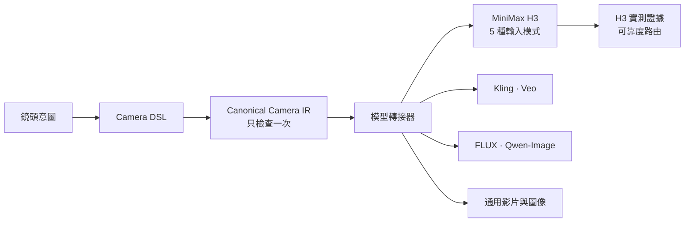

[English](README.md) | **繁體中文**

# Cinematic Director Camera DSL

**用真正的鏡頭語言控制 AI 影片的攝影機，不再靠模糊的提示詞。**

鏡頭只寫一次。鏡頭意圖不變。自動編譯成各模型的寫法。

```text
/MS /LOWANGLE /DOLLYIN:MS>MCU:SLOW
```

同一個鏡頭意圖，可以編譯給 **MiniMax H3 · Kling · Veo · FLUX · Qwen-Image · Qwen-Image-Edit · 通用影片與圖像模型**。

**MiniMax H3 另外有實測可靠度路由**，涵蓋 H3 全部五種輸入模式：T2VA、I2VA、FL2VA、L2VA、Ref2VA。

`104 個指令` · `244 個別名` · `8 個模型轉接器` · `5 種 H3 輸入模式` · `866/866 測試通過` · `MIT`

這是 Claude Code 的 skill，也可以用 Python 命令列執行。[30 秒示範](#30-秒示範) · [安裝](#安裝) · [快速開始](#快速開始) · [MiniMax H3 實測](#minimax-h3-實測)

## 30 秒示範

你想要的鏡頭：*中景，低角度仰拍，攝影機慢慢往人物推近，最後停在中近景。*

你寫：

```text
/MS /LOWANGLE /DOLLYIN:MS>MCU:SLOW
```

Skill 會把它讀成一個明確的鏡頭意圖：

| | |
|---|---|
| 景別 | 中景，腰部以上 |
| 機位角度 | 低角度，由下往上看 |
| 運鏡 | 推軌：攝影機本身往人物前進，不是變焦 |
| 起幅 | MS 中景 |
| 落幅 | MCU 中近景，胸部以上 |
| 速度 | SLOW 慢 |
| 沒指定的部分 | 攝影機推多遠，會列出來，不會自己補 |

MiniMax H3 的運鏡文字，程式實際輸出：

> The camera looks up at {SUBJECT} from a low angle. The camera starts on a medium shot that frames {SUBJECT} from the waist up. The camera pushes in at slow speed. The push continues steadily over the whole video. The final frame is a medium close-up of {SUBJECT} from the chest up. The focal length stays the same.

選定 H3 首幀模式時，還會告訴你要注意什麼。以下是程式實際輸出，過長的行用 … 省略：

```text
WARNING: S1: H3: with nothing near the lens a push reads as a zoom (SRC-009 camera-grammar:41-43). The DSL cannot add scene objects; add a near object in the scene description if the travel must read.
UNSPECIFIED (left to the model): S1.DOLLYIN.amount
H3 routing (models/minimax_h3_profile.yaml) — evidence scope: mode I2VA, generation profile LOCAL_H3_I2VA_PDD8_Q_416: MIXED
  shot size MEDIUM SHOT: from the first frame — reliability HIGH (PROVISIONAL)
  DOLLYIN production route (DSL semantics unchanged): … with_foreground_motion_anchor: PARALLAX_ASSISTED_PUSH_IN PRODUCTION_VALIDATED (… confidence 3/3 tested seeds PASS …)
  UNVERIFIED under this scope: LOWANGLE
```

白話說：在 H3 首幀模式下，從中景推到中近景的推鏡，只要首幀裡有一個靠近鏡頭的物件，3 次測試 3 次通過。低角度在這個模式從來沒有測過，所以標成 UNVERIFIED，不會用猜的。

## 為什麼不直接寫運鏡提示詞？

**不用 DSL**

> 「緩慢的電影感低角度推近」

- 這是推軌，還是變焦？
- 攝影機要多低？
- 鏡頭從哪個景別開始？要停在哪裡？
- 換一個模型重寫時，運鏡會不會被偷偷改掉？
- H3 真的會照做嗎？

**用 DSL**

```text
/MS /LOWANGLE /DOLLYIN:MS>MCU:SLOW
```

- ✓ 是推軌，不是變焦
- ✓ 從中景開始
- ✓ 停在中近景
- ✓ 保留低角度
- ✓ 速度寫明
- ✓ 換模型時用字可以變，鏡頭不能變
- ✓ 生成前就能查 H3 的實測證據

## 跟一般提示詞庫有什麼不同

**一套鏡頭語言，容易混淆的運鏡分得清清楚楚。** 一般提示詞常把這些混在一起，這套 DSL 不會：

| 不一樣 | 差別 |
|---|---|
| 搖鏡 ≠ 橫移 | 搖鏡是攝影機原地轉動；橫移是攝影機往側面平移 |
| 上下搖 ≠ 升降 | 上下搖是鏡頭往上或往下轉；升降是整台攝影機升高或降低 |
| 推軌 ≠ 變焦 | 推軌是攝影機移動；變焦只改變焦距 |
| 環繞 ≠ 人物轉身 | 環繞是攝影機繞著人物走；人物本身不動 |
| 主觀鏡頭 ≠ 看鏡頭 | 主觀鏡頭是角色看到的畫面；看鏡頭是視線方向 |
| 移焦 ≠ 運鏡 | 移焦只換對焦位置；攝影機不動 |
| 遠景 ≠ 廣角鏡頭 | 一個是景別，一個是鏡頭 |

**轉接器只換用字，不換鏡頭意圖。** 同一個鏡頭、三個模型，都是程式實際輸出：

| 模型 | `/MS /LOWANGLE /DOLLYIN:MS>MCU:SLOW` 的運鏡文字 |
|---|---|
| MiniMax H3 | The camera looks up at {SUBJECT} from a low angle. The camera starts on a medium shot … The camera pushes in at slow speed. … |
| Kling | 中景，{SUBJECT}腰部以上入画。仰拍，镜头从下往上看{SUBJECT}。推镜：镜头缓慢地向前推进靠近{SUBJECT}，最后停在近景… |
| Veo | A medium shot framing {SUBJECT} from the waist up. The camera looks up at {SUBJECT} from a low angle. From this opening framing, the camera moves forward along the lens axis toward {SUBJECT}, slowly. … |

**預設是嚴格模式。** 不會自己加速度、幅度、落幅、鏡頭、對焦或多餘的運鏡。你沒指定的部分會列在 `UNSPECIFIED`。指令本身定義就決定的值，例如急推變焦一定又快又大，會標成 `DEFINITION_IMPLIED`。

**導演模式要你開口才會用。** 建議會標成 `DIRECTOR_SUGGESTED`，和你寫的分開，永遠不會蓋掉你的鏡頭。

**H3 的證據只用在它測過的範圍。** 不會假裝 H3 每種模式的表現都一樣。

## MiniMax H3 實測

一般提示詞清單寫完提示詞就結束了。這個專案還實際用 MiniMax H3 把鏡頭生成出來，量測攝影機到底怎麼動，而且五種輸入模式都測過：

| 模式 | 你給 H3 的東西 |
|---|---|
| T2VA | 只有文字 |
| I2VA | 一張首幀 |
| FL2VA | 首幀和尾幀 |
| L2VA | 一張尾幀 |
| Ref2VA | 參考圖，例如臉或服裝 |

五種模式都會生成有聲音的影片，也都用同一個運鏡核心。每種模式的包裝只負責把運鏡文字放進該模式的官方提示詞格式，沒有任何一種模式有自己的一套鏡頭語言。

實測看到的事：

- **同一個運鏡，在某個模式很穩，在另一個模式卻很弱。** `/MS /TILT:DOWN` 在 I2VA、FL2VA、L2VA 是 PRODUCTION_VALIDATED，在 T2VA 和 Ref2VA 是 LOW。
- **只靠文字，攝影機會動，但景別抓不住。** T2VA 的 12 條純運鏡路線有 9 條 PRODUCTION_VALIDATED；一旦要求起幅景別，16 條裡一條都沒有，主要原因是純文字生成的畫面會比要求的更寬。
- **推軌在好幾個模式都可靠。** 純運鏡的 `/DOLLYIN` 在 T2VA、I2VA、Ref2VA 都是 PRODUCTION_VALIDATED。
- **45 度環繞偏弱。** `/ORBIT:R:45` 在 T2VA、I2VA、L2VA、Ref2VA 兩種證據都是 LOW。
- **FL2VA 照首尾幀走。** 尾幀已經是運鏡終點時，16 條有條件的路線有 11 條 PRODUCTION_VALIDATED；首尾幀用同一張圖時，攝影機不會動。

## 實測證據怎麼看

鏡頭語言只有一套，實測證據也只有一套，叫 **H3 Camera Production Evidence**，分成兩種。

**CAMERA_ONLY：H3 有沒有做出這個運鏡？**
搖鏡、上下搖、橫移、升降、推軌、環繞和固定鏡頭，在一個固定場景裡測，畫面裡沒有要框住的東西。判定看影片裡的攝影機幾何：近、中、遠的景物是一起動，像轉動；還是依遠近不同速度動，像平移；透視怎麼變化；消失點往哪裡走。

**CONSTRAINED_PRODUCTION：H3 做出運鏡的同時，能不能滿足這個鏡頭的要求？**
起幅、落幅、停在哪裡、主體在畫面的位置、相對參考目標的行為。這些測試的參考目標是一個人物，但也可以是一群人、一台車、一個物件或一棟建築。它只是測試的設定，不是 DSL 的分類。

| 狀態 | 意思 |
|---|---|
| PRODUCTION_VALIDATED | 3 次測試 3 次通過 |
| CONDITIONAL | 3 次通過 2 次 |
| LOW | 3 次通過 0 或 1 次 |
| INSUFFICIENT_EVIDENCE | 輸入條件做不出這個運鏡，或量測無法判定 |
| UNVERIFIED | 這個確切範圍沒有測過 |

**可靠度只算在測過的範圍。** 結果只適用於它自己的模式、測試 profile、指令、方向、起幅與落幅、角度和證據類型。以下是 routing 的實際回答：

- I2VA 的結果不會借給 T2VA：`/MS /TILT:DOWN` 在 I2VA 是 PRODUCTION_VALIDATED，在 T2VA 仍是 LOW。
- 中景的結果不會借給全景：`/FS /TILT:DOWN` 得到 "no production route measured under this scope for start framing FS — UNVERIFIED"，`/MS /TILT:DOWN` 只列為相關證據。
- 45 度的結果不會借給 90 度：`/MS /ORBIT:R:90` 得到 UNVERIFIED，`/MS /ORBIT:R:45` 只列為相關證據。

沒有完全相符的證據就是 UNVERIFIED，絕不猜一個等級。

各模式的結果，依序是 PRODUCTION_VALIDATED / CONDITIONAL / LOW / INSUFFICIENT_EVIDENCE，每條路線 3 個 seed：

| 模式 | CONSTRAINED_PRODUCTION，16 條路線 | CAMERA_ONLY，12 條路線 |
|---|---|---|
| T2VA | 0 / 0 / 16 / 0 | 9 / 1 / 2 / 0 |
| I2VA | 3 / 2 / 11 / 0 | 2 / 6 / 4 / 0 |
| FL2VA | 11 / 0 / 1 / 4 | 1 / 0 / 0 / 11 |
| L2VA | 2 / 3 / 11 / 0 | 1 / 2 / 6 / 3 |
| Ref2VA | 0 / 1 / 15 / 0 | 7 / 2 / 2 / 1 |

每一條路線和它的限制：[models/minimax_h3.md](models/minimax_h3.md)。

## 可以用來做什麼

- 把分鏡表上的運鏡描述，變成精確的鏡頭指令。
- 查「慢推近」「仰拍英雄」「遮擋轉場」這類常見說法；說法不清楚時，會先問你，不會用猜的。
- 換 AI 影片模型時，鏡頭意圖保持不變。
- 產生 T2VA、I2VA、FL2VA、L2VA、Ref2VA 的完整 H3 提示詞。
- 生成前先抓出互相矛盾的運鏡。
- 檢查一場戲各鏡頭之間的軸線、視線和畫面方向。
- 把推軌和變焦、搖鏡和橫移、上下搖和升降分清楚。
- 請導演模式給建議，又不會弄丟你原本寫的鏡頭。
- 花 GPU 時間之前，先查這個運鏡在 H3 的實測證據。

## 支援的模型

| 模型 | 轉接器 | 實測證據 |
|---|---|---|
| MiniMax H3 | 有，五種輸入模式都支援 | 有：H3 Camera Production Evidence |
| Kling | 有 | 沒有：用字依據公開的寫法指南 |
| Veo | 有 | 沒有：用字依據公開的寫法指南 |
| FLUX | 有，靜態圖像 | 沒有 |
| Qwen-Image | 有，靜態圖像 | 沒有 |
| Qwen-Image-Edit | 有，靜態圖像 | 沒有 |
| 通用影片 | 有 | 沒有：最明確的寫法 |
| 通用圖像 | 有 | 沒有：運鏡會寫成它所代表的攝影機位置 |

只有 MiniMax H3 有實測可靠度。其他模型請看第一次生成的結果再調整。

## 安裝

```bash
git clone https://github.com/SK-SL-source/cinematic-director-camera-dsl "$HOME/.claude/skills/cinematic-director-camera-dsl"
```

重開 Claude Code 就完成了。只需要 Python 3，不用安裝其他套件，也不用 API key。

## 快速開始

**在 Claude Code 裡**，先打 skill 名稱，再接鏡頭：

```text
/cinematic-director-camera-dsl /MS /LOWANGLE /DOLLYIN:MS>MCU:SLOW
```

skill 名稱一定要放前面：訊息如果用 `/MS` 開頭，會被當成斜線指令。也可以直接用文字描述鏡頭，請 Claude 使用這個 skill，它會列出它選了哪些指令。

**在命令列**，從 skill 資料夾執行：

```bash
python scripts/camera_dsl.py render "/MS /LOWANGLE /DOLLYIN:MS>MCU:SLOW" --model minimax_h3
python scripts/camera_dsl.py render "/WS /PAN:L" --model kling
python scripts/camera_dsl.py explain /DOLLYIN
python scripts/example_library.py search "慢推近"
```

模型名稱：`minimax_h3`、`kling`、`veo`、`flux`、`qwen_image`、`qwen_image_edit`、`generic_video`、`generic_image`。在 Windows 的 Git Bash，指令前面要加 `MSYS_NO_PATHCONV=1`。

你會拿到運鏡文字，還有：

| 欄位 | 意思 |
|---|---|
| `UNSPECIFIED` | 你留給模型決定的部分 |
| `DEFINITION_IMPLIED` | 指令本身定義就決定的值 |
| `WARNING` | 會生成，但有你該知道的風險 |
| `ERROR` | 不會生成；會列出原因和改法 |
| `H3 routing` | MiniMax H3 專用：你這個範圍的實測可靠度 |

## H3 用法

```bash
# 運鏡文字，加上某個模式的實測可靠度
python scripts/camera_dsl.py render "/MS /TILT:DOWN" --model minimax_h3 --h3-mode i2va --h3-profile LOCAL_H3_I2VA_PDD8_Q_416

# 沒有要框住東西的運鏡：查 CAMERA_ONLY 證據
python scripts/camera_dsl.py render "/DOLLYIN" --model minimax_h3 --h3-profile LOCAL_H3_T2VA_PDD8_Q_416 --h3-subject-context camera_only

# 某個模式的完整官方 H3 提示詞，運鏡文字一樣
python scripts/h3_wrappers.py i2va "/MS /TILT:DOWN"
```

| 模式 | 測試 profile |
|---|---|
| T2VA | `LOCAL_H3_T2VA_PDD8_Q_416` |
| I2VA | `LOCAL_H3_I2VA_PDD8_Q_416` |
| FL2VA | `LOCAL_H3_FL2VA_PDD8_Q_416` |
| L2VA | `LOCAL_H3_L2VA_PDD8_Q_416` |
| Ref2VA | `LOCAL_H3_REF2VA_PDD8_Q_416` |

沒有指定 profile 時，每一項都是 UNVERIFIED：沒有預設值，也不會用猜的。加 `--lang zh` 會用中文顯示 routing。

實測得到的使用技巧：

- 起幅要準就給 H3 一張首幀。只靠文字，畫面通常會比要求的更寬。
- 想讓推鏡看起來是攝影機真的往前走，而不是變焦，就讓首幀有一個靠近鏡頭的物件。
- 一個鏡頭只做一個運鏡最穩。

## 指令速查

| 類別 | 指令 |
|---|---|
| 景別 | `/EWS /WS /FS /MFS /COWBOY /MS /MCU /CU /ECU` |
| 角度與高度 | `/EYELEVEL /HIGHANGLE /LOWANGLE /BIRDSEYE /TOPDOWN /WORMSEYE /DUTCH /GROUNDLEVEL /SHOULDERLEVEL` |
| 攝影機運動 | `/PAN:L /TILT:UP /TRUCK:R /PEDESTAL:DOWN /DOLLYIN /DOLLYOUT /ZOOMIN /ZOOMOUT /CRANE:UP /DOLLYZOOM` |
| 繞著或跟著主體 | `/ORBIT:R:45 /TRACKSIDE:R /FOLLOW /LEAD` |
| 鏡頭與對焦 | `/WIDEANGLE /TELEPHOTO /MACRO /SHALLOW /DEEPFOCUS /RACKFOCUS:A>B` |
| 構圖與取景 | `/OTS:A>B /TWOSHOT /POV /PROFILE /THIRDS /CENTER /SYMMETRY /NEGSPACE` |

細節寫在冒號後面：起幅與落幅 `/DOLLYIN:MS>MCU`、速度 `:SLOW`、方向 `:L` `:R` `:UP` `:DOWN`、角度 `/ORBIT:R:45`。用 `explain` 可以查任何指令的確切意思。全部 104 個指令在 [references/](references/)，其他名稱的對照在 [references/15_aliases.md](references/15_aliases.md)。

## 分鏡、多鏡頭與連戲

```bash
python scripts/camera_dsl.py shots "S1: /WS /AXIS:A-B\nS2: /MCU /OTS:A>B"
```

- 一行一個鏡頭，寫成 `S1:`、`S2:`；在命令列裡用 `\n` 分隔。
- `CONTINUOUS` 讓這一鏡從上一鏡結束的地方開始。
- 同一鏡裡依序做幾個運鏡：`0-3s: /PAN:R 3-7s: /DOLLYIN:SLOW` 或 `/PAN:R THEN /DOLLYIN`。
- 各鏡頭之間會檢查連戲。沒說明就越軸，會被擋下來，以下是程式實際輸出：

```text
ERROR: S2: [C01-AXIS-CROSSED] S2: the line flips (A-B -> B-A) without a declared crossing. Fix: Add /CROSSAXIS:MOVE|NEUTRAL|CUTAWAY|REESTABLISH|BLOCKING, or keep /AXIS:A-B
```

## 範例

每個範例都有指令、skill 解讀出來的結果，以及各模型的實際輸出。

- [常用說法案例庫](examples/production_library/README.md)：66 個常見運鏡說法與敘事情境，對應到候選 DSL。說法不清楚時會列出候選並先問清楚；特效、剪輯和慢動作都不算進運鏡。
- [基本運鏡控制](examples/basic.md)：嚴格模式只寫你要的、同一鏡頭給四個轉接器、搖鏡和橫移的差別、廣角鏡頭和遠景的差別。
- [對話鏡頭](examples/dialogue.md)：軸線上的雙人鏡頭、正反打過肩鏡頭、攝影機不動的移焦、越軸、先看再接主觀鏡頭。
- [動作場面](examples/action.md)：側面跟拍奔跑、手持追逐、甩鏡要有終點、完整環繞、兩個運鏡依序進行。
- [分鏡流程](examples/storyboard.md)：四個鏡頭的一場戲、接續上一鏡的鏡頭、分鏡備註和導演建議。
- [進階組合](examples/advanced_combinations.md)：滑動變焦、升降加上下搖、橫移加搖鏡、空拍揭露、環繞當成靜態圖、一次太多運鏡。

## 架構



DSL 只解析一次，變成一份 Canonical Camera IR，裡面把景別、機位、運鏡、鏡頭、對焦、構圖和器材分開記錄。每個轉接器都把同一份 IR 寫成自己模型的用字。MiniMax H3 是一個共用的運鏡核心，接到五種模式的包裝，routing 再依你指定的模式和 profile 讀取實測證據。routing 只負責回報，絕不會改動鏡頭。

## 實測方法

- 每條路線是一個 DSL 指令、一種 H3 輸入模式、一個測試 profile，各用 3 個 seed 生成。
- 通過標準在生成影片之前就寫好。
- 每支影片都從畫面量測，包括攝影機幾何、前中後景的移動、主體大小與位置、起幅與落幅，再用眼睛逐支檢查。
- 測試用的是本機的 H3 環境，416×736、8 步加速。結果只代表這個設定；正式生產尺寸 768×1344 是 UNVERIFIED。
- 更早的 42 格 Ref2VA 矩陣另外保留，當作歷史紀錄。

## 已知限制

- H3 的可靠度會因模式和運鏡指令而不同。
- 並沒有把所有指令 × 模式 × 景別 × 角度的組合都測過。UNVERIFIED 就是字面意思：沒測過。
- LOW 不代表 DSL 的定義錯了，而是 H3 在那個範圍沒有穩定照著運鏡文字做。
- FL2VA 取決於首尾幀：尾幀已經是運鏡終點，運鏡才會出現。
- 45 度環繞比好幾種平移運鏡弱。T2VA 的純運鏡測試裡，推軌、橫移、升降都是 PRODUCTION_VALIDATED，環繞是 LOW。
- 同一次 H3 生成裡做兩個運鏡，常常會混在一起；一個鏡頭一個運鏡最穩。
- Kling、Veo、FLUX、Qwen 的用字沒有實測過；也沒有使用 Kling 的 `camera_control` 參數，輸出只有文字。

## 專案狀態

| | |
|---|---|
| 版本 | v1.0.0 |
| 測試 | 866/866 通過：`python scripts/run_tests.py` |
| H3 生產基線 | COMPLETE：兩種證據、五種輸入模式都完成 |
| 所有指令 × 模式 × 景別 × 角度 | PARTIAL，設計上如此：沒測過的範圍一律回答 UNVERIFIED |

修改紀錄見 [CHANGELOG.md](CHANGELOG.md)。

## 授權

MIT，見 [LICENSE](LICENSE)。Copyright (c) 2026 Sidekick Animation Studio Ltd.

參考過的開源專案列在 [SOURCES.md](SOURCES.md)。
